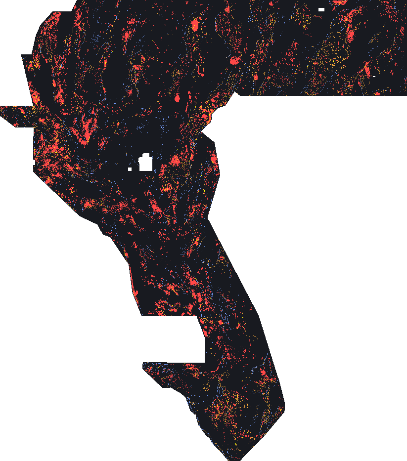

# Validation — what was tested, what passed, what failed

Everything on this page is **[MEASURED-HERE]** unless tagged otherwise: the script,
the inputs' SHA-256 values and the split hash are recorded in
`data/evidence/detector_results.json` and `data/evidence/holdout_manifest.json`.

## 1. The metric implementation is anchored to the official sources

| Check | Anchor | Result |
|---|---|---|
| Worked example: `TP_w=3.00, FP_w=1.89, FN_w=2.00` → 0.60 | official problem description, "Scoring example" | reproduced (`tests/test_metric.py::test_official_worked_example_arithmetic`) |
| `TP_w + FN_w = |G|` for any prediction | follows from the two published definitions | asserted on synthetic rasters |
| `DTI = TP_w / (0.2·(TP_w + FP_w) + 0.8·|G|)` | algebra of the published terms | asserted in `test_dti_identity_form` |
| Known-fault pixels are pixel-exact and free; a 1-px offset is penalised | forum 11516 post 4 (staff) | asserted in `test_known_mask_is_pixel_exact_and_free` |
| Distance weighting: `k=1` at 0 px, `2/3` at 1 px, `0` at 3 px | published kernel | asserted in `test_distance_weighting_degrades_with_offset` |

## 2. The holdout is spatially blocked, balanced, and partly sealed

* 512 px (51.2 km) blocks; whole structures, never single pixels.
* Folds balanced greedily on **proxy fault mass**, so no fold is starved of positives.
* 56 blocks, 4 folds, **14 blocks sealed before any candidate was built**; the sealed
  set was read exactly once, at the end, for the arm that the tuning folds selected.
* Split digest: `data/evidence/holdout_manifest.json` → `split_sha256`
  (`41332369d7dd448b…`); inputs pinned by SHA-256 in the same file.

**Honest limitation.** Blocks are cut on a regular grid, so a fault that happens to
straddle a block edge appears on both sides of the split. The collar is the metric's own
R = 3 px, which bounds the leak to that width; it is not zero.

## 3. The shipped candidate (H19-C)

*Colours: blue = training catalogue (masked out of scoring, free), orange = SGMC state-map structure
lines with no label within 300 m, red = the multi-family physics conjunction. Yellow marks pixels where
components coincide.*

<!-- CANDIDATE_BLOCK -->

## 4. Arms, controls and the matched-mass comparison

<!-- RESULTS_TABLE -->

Reading the table:

* **`known_catalogue` scores exactly 0.0** on the proxy population. That is the
  acceptance control: the proxy truth has, by construction, no training label within
  300 m, so a catalogue copy cannot earn anything. It confirms the population is not a
  restatement of the labels.
* The **matched random lineament network** is the control that matters. Any lineament
  detector can look good simply because faults are lines: a random network with the same
  support already captures part of the proxy.
* The **matched-mass** column re-scores every arm at the shipped file's own support
  (172,974 px) so no arm wins by buying more coverage.

## 5. The sealed read (pre-registered, single)

<!-- SEALED_BLOCK -->

## 6. What failed, and what that means

* **The sealed slice does not confirm a win over the shipped `ens12` file.** It is
  reported here rather than dropped: the arm the tuning folds promoted this pass
  (`topo_ridge`, 250,000 px) scores **0.0003 against the comparator's 0.0085** on the 14
  sealed blocks, and the conjunction — which *ties* the comparator on the whole proxy
  population (mean difference −0.0000, P(better) 0.49) — was not promoted. Under the bar
  this project set (an improvement counts only if it survives the sealed slice *and* an
  attempt to argue it away as an artefact), **no arm here is a validated replacement for
  the shipped file.** They are candidates whose *mechanisms* are defensible and whose
  *controls* are published beside them. That is the honest state, and it is why the
  packaged file is labelled a candidate on every page.
* **Proxy bias.** The SGMC proxy is drawn from published state geologic maps, i.e. from
  surface mapping — so it systematically rewards topographic detectors and under-rewards
  magnetic ones. The scored population was drawn by experts from the geophysics. This is
  the single largest threat to the proxy's validity as a selection instrument, and it is
  the reason the shipped field's physics component is a **conjunction** (which cannot win
  by exploiting one proxy's bias) rather than the best-scoring single family.
* **Per-block DTI is not a decomposition of the global DTI** (the FP term is global). The
  paired block bootstrap here compares two emission fields block-by-block on the *same*
  proxy truth, which is a valid paired comparison, but the numbers are not additive and
  are never summed into a headline.
* **No leaderboard score is claimed.** Nothing here is a substitute for the hidden new-fault
  set; the mean of this project's expectations is a *direction*, not a prediction.
